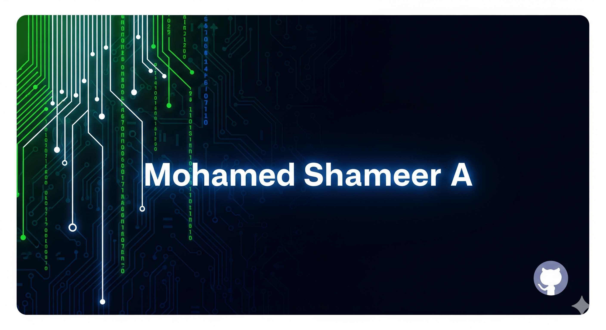

<!-- Profile Banner -->

👋 Hi, I'm Shameer!
🚀 Full-Stack Developer | AI & IoT Enthusiast | Open-Source Contributor I love building AI-powered applications, IoT solutions, and open-source tools.

Currently exploring Flutter, ESP32, Next.js, and AI/ML projects.

🌟 About Me
🎓 Engineering Student & Tech Explorer

💡 Passionate about AI, IoT, and Cloud Computing - 🌱 Currently learning Machine Learning & Embedded Systems - 🤝 Open to collaborating on Open-Source Projects - ✍️ I also share technical blogs and project write-ups

⚡ Fun fact: I debug faster with coffee ☕

🛠️ Tech Stack

🚀 Featured Projects
🔹 Driver Drowsiness Detection System

🔹 Smart Billing with ESP32

🔹 AgriLink – AI for Farmers

🔹 Flutter AI Lawyer Bot

📊 GitHub Stats

📫 Connect With Me

✨ “Code. Create. Contribute. Repeat.”
