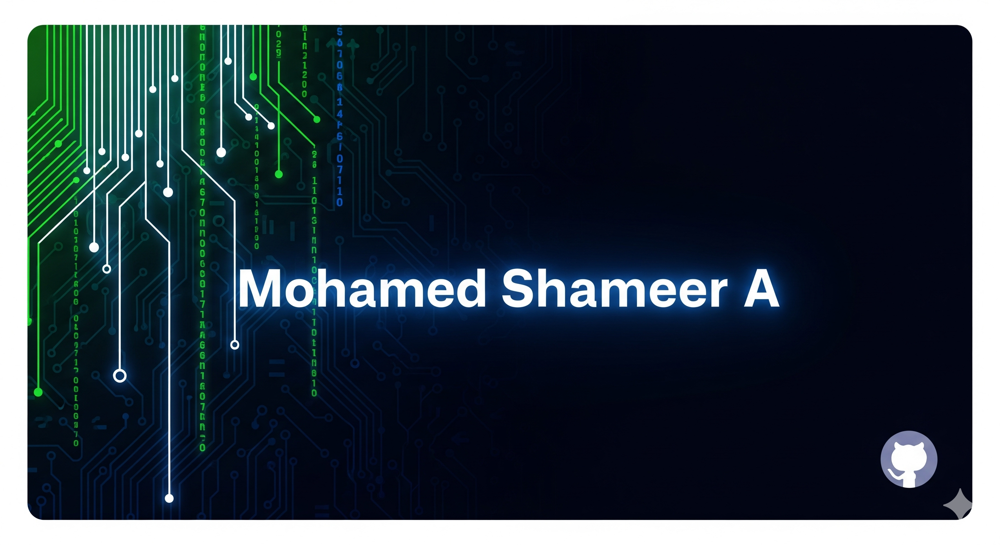

<!-- Profile Banner -->

  

# 👋 Hi there, I'm Mohamed Shameer!

### 🚀 Full-Stack Developer | AI & IoT Enthusiast | Open-Source Contributor

I am a passionate engineering student who loves building **AI-powered applications, IoT solutions, and open-source tools**. I enjoy transforming complex problems into elegant, efficient, and scalable tech solutions. Currently, I am exploring **Flutter, ESP32, Next.js, and Machine Learning**.

---

## 🌟 About Me
- 🎓 **Engineering Student & Tech Explorer** constantly learning new frameworks.
- 💡 Passionate about **AI, IoT, and Cloud Computing**.
- 🌱 Currently diving deep into **Machine Learning & Embedded Systems**.
- 🤝 Open to collaborating on **Open-Source Projects** and innovative ideas.
- ✍️ I also share technical blogs and project write-ups.
- ⚡ **Fun fact**: I debug faster with coffee ☕.

---

## 🛠️ Tech Stack & Tools

  
  
  
  
   
  
  
  
   
  
  
  

---

## 🚀 Featured Projects

Here are some of the standout projects I've been working on:

| Project | Description |
| ------- | ----------- |
| 🔹 **[Driver Drowsiness Detector](https://github.com/Shameer2006/driver-drowsiness-detector-using-streamlit)** | An AI-powered application built using Streamlit that detects driver fatigue and alerts them in real-time. |
| 🔹 **[LawBot](https://github.com/Shameer2006/lawbot)** | An intelligent conversational agent utilizing AI to assist with legal queries. |
| 🔹 **[Linition](https://github.com/Shameer2006/linition)** | A comprehensive task and project management web application. |
| 🔹 **[DataVision AI](https://github.com/Shameer2006/datavision-ai)** | A data analytics and visualization platform leveraging AI. |

*You can view more of my repositories on my [GitHub Profile](https://github.com/Shameer2006).*

---

## 📊 GitHub Stats

  
  

---

## 📫 Connect With Me

  
  
  

---

  <i>“Code. Create. Contribute. Repeat.”</i>

